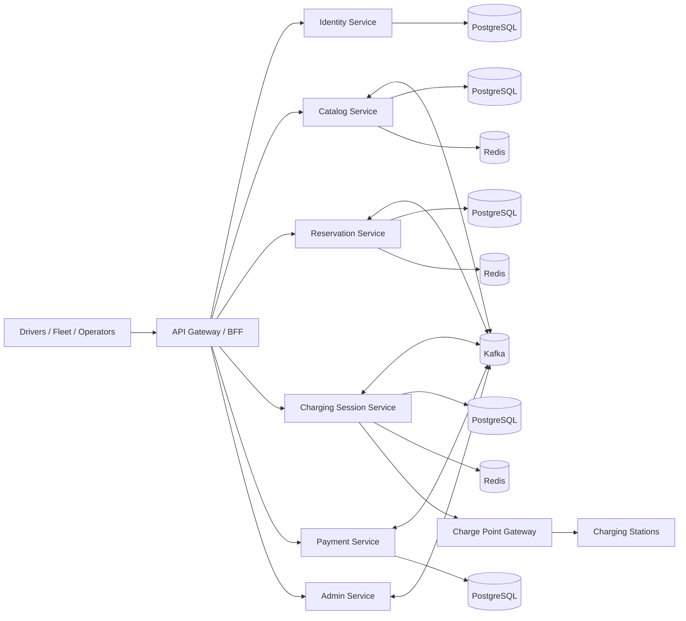
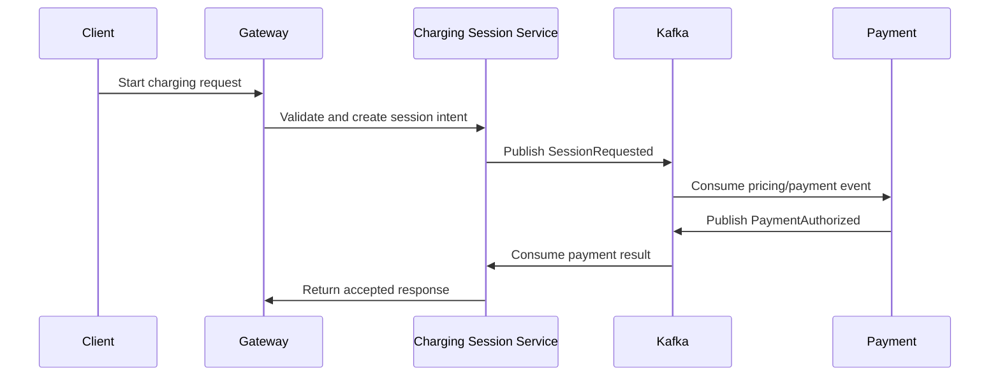
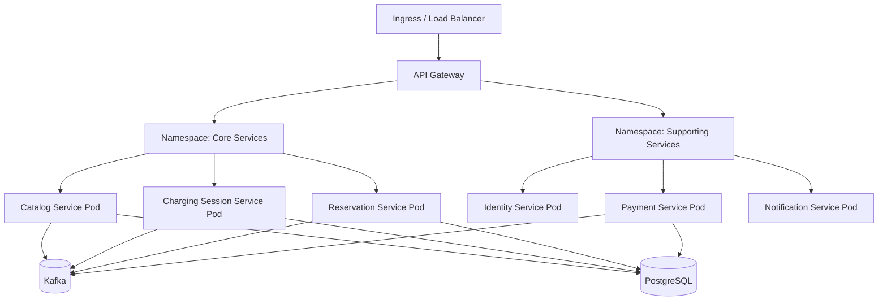
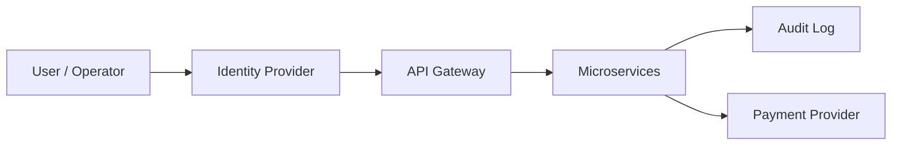
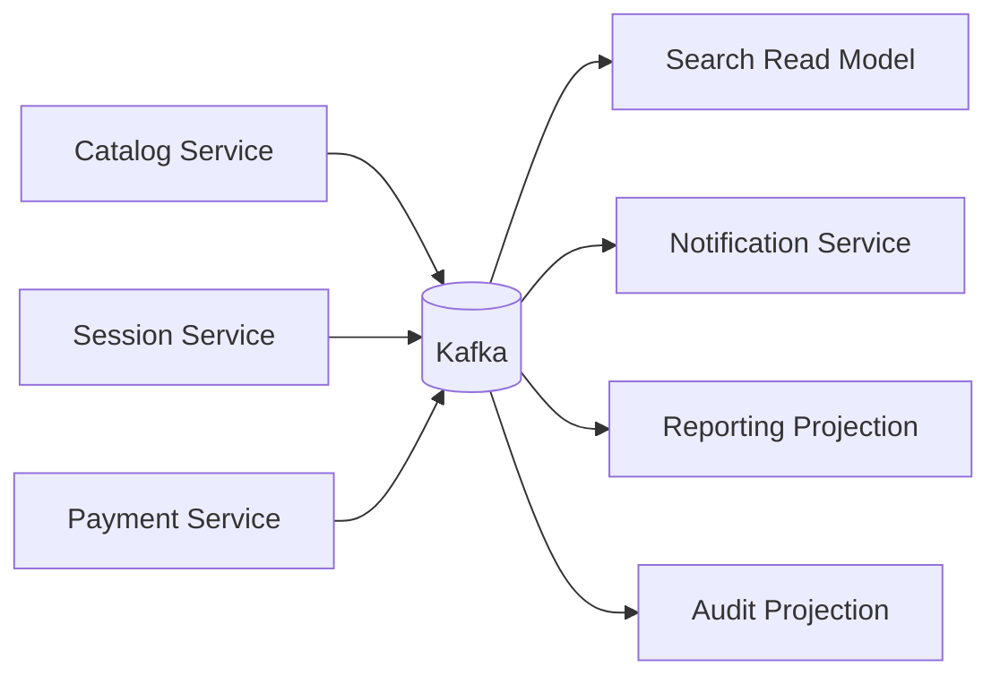
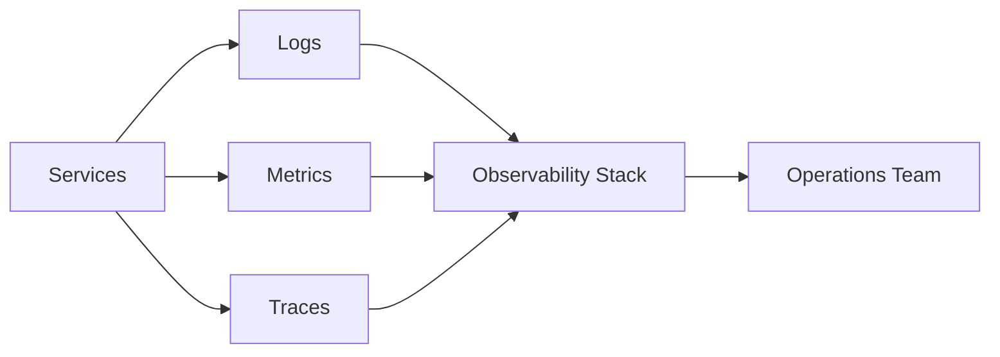

# EV Charging Network Platform Architecture

## Business Problem

The platform coordinates a real-world distributed system: user search traffic, station telemetry, charge point control, pricing, payment, and operational oversight. These concerns evolve at different speeds and have different consistency requirements. A single tightly coupled service would become fragile quickly, especially once multiple station operators, payment flows, and regional deployments are involved.

The architecture therefore favors independently deployable microservices, event-driven integration, and read-optimized views for discovery and operational queries.

## Architecture Overview

The platform is built as a set of Spring Boot 3 microservices running on Kubernetes. Kafka is the event backbone, PostgreSQL is the system-of-record datastore for each service, and Redis supports caching, idempotency, and short-lived coordination. The architecture separates command paths from read paths so high-traffic search can scale independently from charging control and billing.

Domain boundaries are defined first in [Domain-Driven Design](domain-driven-design.md). Service boundaries should follow those bounded contexts unless there is a clear operational reason to combine or split them.

## Microservices

### 1. Identity Service

Handles authentication, authorization, roles, organization membership, and service-to-service credentials.

### 2. Catalog Service

Owns station metadata, connector definitions, capabilities, tariffs, and search indexes.

### 3. Availability Service

Maintains live connector state, occupancy, and operator-reported availability.

### 4. Reservation Service

Creates, confirms, expires, and cancels reservations for eligible stations and connectors.

### 5. Charging Session Service

Owns the session lifecycle, meter values, control commands, and session state transitions.

### 6. Pricing Service

Calculates tariffs, taxes, fees, and estimated session cost. In early phases this may be embedded in the session flow, then extracted later.

### 7. Payment Service

Coordinates authorization, capture, refund, and reconciliation with external payment processors.

### 8. Notification Service

Publishes email, SMS, and push notifications for business events and operational alerts.

### 9. Charge Point Gateway

Terminates the station protocol layer and translates device communication into platform commands and events.

### 10. Admin and Reporting Service

Provides operator views, reconciliation reports, audit search, and support tools.

## Communication

External consumers interact with the platform through HTTPS APIs exposed by the gateway. Internal synchronous calls should be limited to cases where a direct response is required. Most business integration should flow through Kafka events.

Communication patterns:

- REST for user-facing and operator-facing APIs.
- Kafka for domain events and asynchronous workflow progression.
- Redis for cache lookups, session locks, and idempotency keys.
- Webhooks only for explicitly external integrations.

## Databases

Each service owns its own PostgreSQL schema or database. No service writes directly into another service’s tables. Cross-service data is synchronized through events and read models.

Recommended storage rules:

- Use PostgreSQL for transactional consistency.
- Use Redis for low-latency caches, distributed locks, and temporary workflow state.
- Avoid cross-database joins.
- Store money in minor units with currency codes.
- Use UTC timestamps everywhere.
- Use immutable event history for auditability.

## Deployment

The system is deployed on Kubernetes with one deployment per service, horizontal pod autoscaling, readiness and liveness probes, and centralized configuration through ConfigMaps and Secrets. Stateless services can scale horizontally, while stateful systems such as PostgreSQL and Kafka are managed as dedicated platform dependencies or external managed services.

Recommended deployment shape:

- API Gateway in a public ingress path.
- Microservices on private cluster networks.
- Kafka and PostgreSQL behind restricted network policies.
- Redis used as a cluster-local dependency for caching and coordination.
- Separate namespaces for dev, test, staging, and production.

## Security

Security is designed around strong identity, least privilege, and auditability.

- OAuth 2.1 / OpenID Connect for human users and operator identities.
- Service-to-service authentication with short-lived credentials or mTLS.
- Role-based access control for drivers, operators, support, and administrators.
- Field-level protection for sensitive personal and payment-adjacent data.
- External payment provider integration to limit PCI scope.
- Full audit logging for session start, stop, pricing changes, refunds, and station management.

## Event Driven Architecture

Kafka is the primary mechanism for decoupling services and preserving workflow history. Producers publish domain events after a state change is committed. Consumers build their own read models and trigger follow-up actions from events.

Design rules:

- Use the outbox pattern for reliable event publication.
- Make consumers idempotent.
- Version events explicitly.
- Prefer append-only event history over mutable shared state.
- Treat event payloads as public contracts.

## Observability

Operational visibility is a first-class requirement because charging workflows span multiple services and external systems.

The platform should provide:

- Structured logs with correlation IDs.
- Metrics for latency, throughput, error rate, queue lag, and session completion.
- Distributed traces across gateway, services, Kafka consumers, and external integrations.
- Dashboards for station uptime, payment success rate, and command latency.
- Alerting for failed session transitions, consumer lag, and station communication failures.

## Key Tradeoffs

- Microservices improve scalability and team autonomy, but increase operational complexity.
- Event-driven workflows improve resilience, but require careful idempotency and debugging discipline.
- PostgreSQL gives strong transactional guarantees, but read models may need denormalization for performance.
- Redis improves latency, but must not become a hidden source of truth.

## Recommended Delivery Sequence

1. Build the identity, catalog, and charging session services first.
2. Add reservation and payment orchestration next.
3. Introduce notification and reporting projections after the core flows are stable.
4. Expand external station protocol handling through the charge point gateway.
