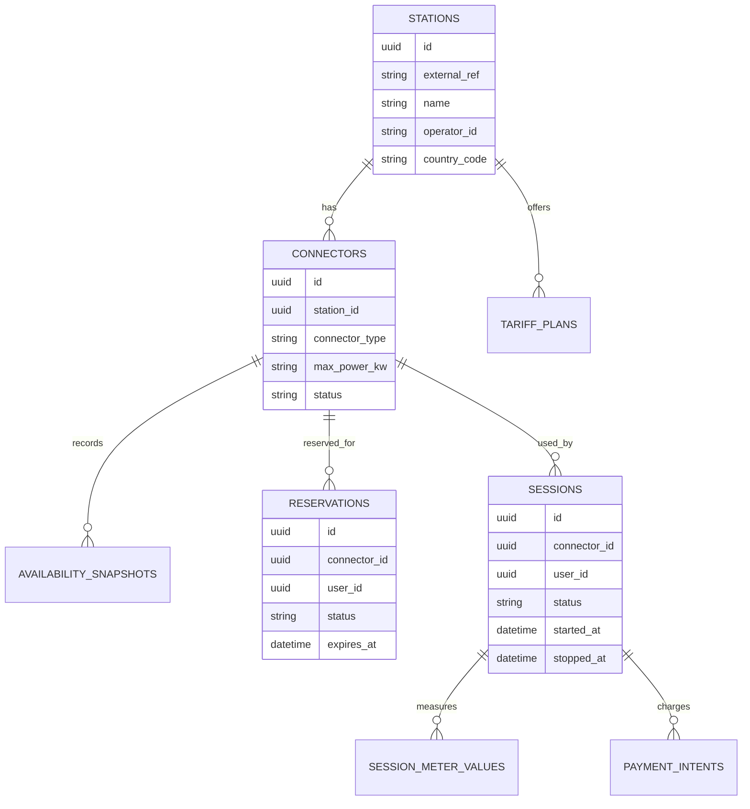

# Database Design

## Design Principles

- One database or schema per service.
- No cross-service foreign keys.
- Normalize transactional data where it helps consistency.
- Denormalize read models where it improves query speed.
- Store timestamps in UTC.
- Store money in integer minor units plus currency code.

## Service Data Ownership

| Service | Primary Tables |
|---|---|
| Identity Service | users, roles, memberships, service_credentials |
| Catalog Service | stations, connectors, tariff_plans, station_tags |
| Availability Service | connector_status, availability_snapshots |
| Reservation Service | reservations, reservation_events |
| Charging Session Service | sessions, session_meter_values, session_commands |
| Pricing Service | price_quotes, tariff_rules |
| Payment Service | payment_intents, payment_captures, refunds |
| Notification Service | notification_jobs, delivery_attempts |
| Reporting Service | projections, audit_entries, support_cases |

## Example Logical Model

## Indexing Guidance

- Index station search fields such as location, operator, connector type, and status.
- Index reservation expiry and session status transitions.
- Index payment intent status and correlation identifiers.
- Use unique constraints for external references and idempotency keys.

## Redis Usage

- Cache read-heavy station search results.
- Store short-lived reservation holds or command locks.
- Store event or command deduplication keys.
- Never store durable business truth only in Redis.

## Data Retention

- Keep audit history longer than operational telemetry.
- Retain payment records according to financial and compliance policy.
- Archive obsolete availability snapshots and transient command logs.

