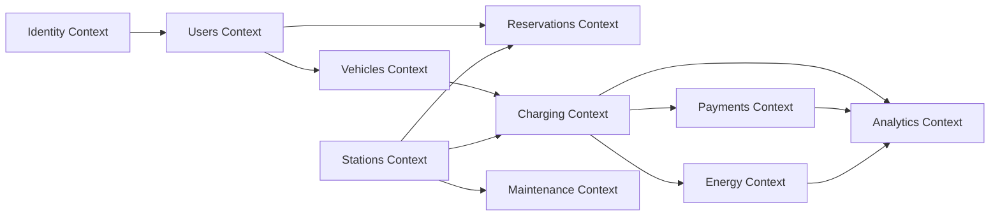
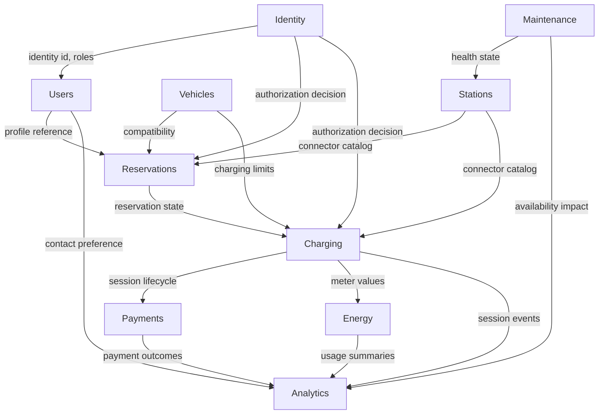
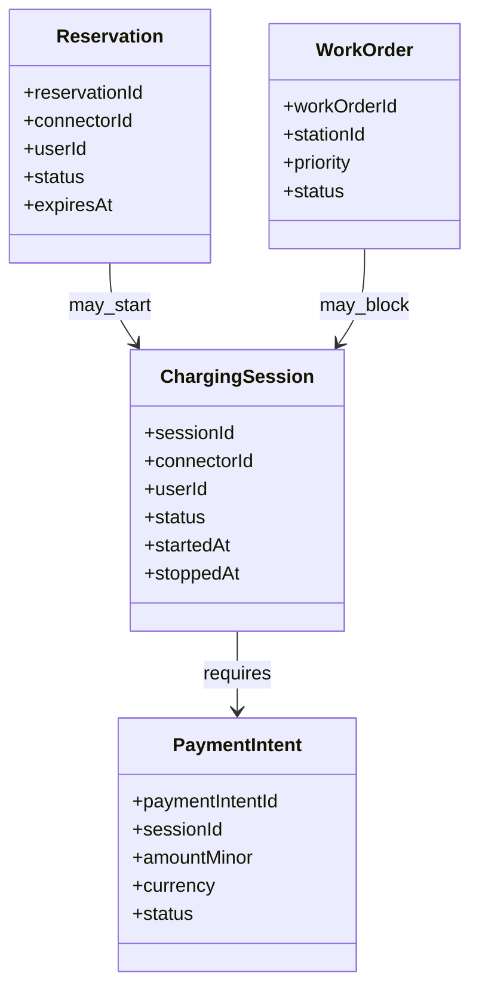
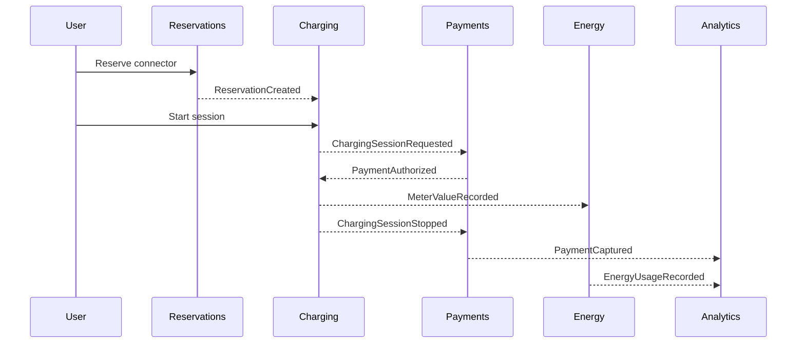

# Domain-Driven Design

## Purpose

This document defines the core domain before implementation starts. The goal is to understand the business language, boundaries, ownership, and event flow of an EV Charging Network Platform before creating Spring Boot services.

Bounded contexts are not always identical to microservices. A context describes a business language and model. A service is a deployment and ownership choice that may implement one context, part of a context, or combine several contexts in the early stages.

## Domain Overview

The platform coordinates drivers, vehicles, charge stations, reservations, charging sessions, payments, station operations, energy usage, and reporting.

## Bounded Contexts

| Context | Core Responsibility | Primary Model | Key Events |
|---|---|---|---|
| Identity | Authentication, authorization, roles, tenant access | Account, Role, Permission, Tenant | IdentityVerified, RoleAssigned |
| Users | Driver and operator profiles, preferences, contact details | UserProfile, OperatorProfile, Preference | UserRegistered, UserProfileUpdated |
| Vehicles | Vehicle identity, connector compatibility, fleet ownership | Vehicle, VehicleProfile, Fleet | VehicleRegistered, VehicleAssignedToFleet |
| Stations | Station catalog, connectors, location, operator ownership | Station, Connector, TariffReference | StationRegistered, ConnectorUpdated |
| Reservations | Connector holds, expiry, cancellation, reservation policy | Reservation, Hold, ReservationPolicy | ReservationCreated, ReservationExpired |
| Charging | Charging session lifecycle, meter values, station commands | ChargingSession, MeterReading, Command | ChargingSessionStarted, MeterValueRecorded |
| Payments | Authorization, capture, refunds, payment reconciliation | PaymentIntent, Capture, Refund | PaymentAuthorized, PaymentCaptured |
| Maintenance | Faults, inspections, repairs, station health | Fault, WorkOrder, MaintenanceTicket | StationFaultDetected, WorkOrderClosed |
| Energy | Energy consumption, grid constraints, pricing inputs | EnergyUsage, LoadProfile, EnergyWindow | EnergyUsageRecorded, LoadLimitChanged |
| Analytics | Reporting projections, business metrics, audit views | Projection, Metric, Report | ProjectionUpdated, ReportGenerated |

## Context Details

### Identity

The Identity context answers: "Who is making this request, and what are they allowed to do?"

Responsibilities:

- Authenticate users and services.
- Manage roles such as driver, fleet manager, operator, support, and admin.
- Issue access tokens and validate tenant membership.
- Provide authorization decisions to other contexts.

Aggregate candidates:

- Account
- Role
- TenantMembership
- ServiceCredential

Context rules:

- Identity does not own driver preferences or vehicle data.
- Other contexts reference users by immutable identity IDs.
- Sensitive credential data never appears in domain events.

### Users

The Users context answers: "What profile, preferences, and contact details belong to this person or organization?"

Responsibilities:

- Manage driver and operator profile data.
- Store communication preferences.
- Track consent and user-facing settings.
- Provide user metadata for reservations, charging, and notifications.

Aggregate candidates:

- UserProfile
- OperatorProfile
- PreferenceSet
- ConsentRecord

Context rules:

- Users depends on Identity for authentication, but owns profile state.
- User events should avoid leaking unnecessary personal data.

### Vehicles

The Vehicles context answers: "Which vehicles can charge, and what connectors or charging limits apply?"

Responsibilities:

- Register vehicles.
- Store connector compatibility and battery capacity.
- Support fleet ownership and assignment.
- Provide charging constraints to reservations and session workflows.

Aggregate candidates:

- Vehicle
- Fleet
- VehicleAssignment
- ChargingCapability

Context rules:

- Vehicles do not own active charging sessions.
- Fleet rules may influence reservation and charging policy.

### Stations

The Stations context answers: "What charging infrastructure exists, where is it, and what can it do?"

Responsibilities:

- Manage station metadata and connector inventory.
- Store location, operator, opening hours, access rules, and connector capabilities.
- Publish catalog changes for search and analytics.
- Reference tariffs without owning final billing calculations.

Aggregate candidates:

- Station
- Connector
- StationOperator
- SiteAccessRule

Context rules:

- Stations owns relatively stable catalog data.
- Live operational state belongs to Maintenance or Charging depending on the event.
- Availability read models may combine station catalog data with live connector state.

### Reservations

The Reservations context answers: "Can this driver hold this connector for a limited time?"

Responsibilities:

- Create, confirm, expire, and cancel reservations.
- Enforce reservation windows and hold policies.
- Prevent conflicting reservations for the same connector.
- Publish reservation state changes to Charging and Notifications.

Aggregate candidates:

- Reservation
- ConnectorHold
- ReservationPolicy

Context rules:

- A reservation is not a charging session.
- Reservation expiry must be deterministic and auditable.
- Redis may support short-lived locks, but PostgreSQL remains the source of truth.

### Charging

The Charging context answers: "What is happening during a real charging session?"

Responsibilities:

- Start and stop charging sessions.
- Track session state transitions.
- Record meter readings.
- Coordinate station commands through the Charge Point Gateway.
- Publish lifecycle events for Payments, Energy, Notifications, and Analytics.

Aggregate candidates:

- ChargingSession
- MeterReading
- StationCommand
- SessionStateTransition

Context rules:

- Charging owns session truth.
- Payment authorization may be required before a session becomes active.
- Meter readings are append-only facts.

### Payments

The Payments context answers: "How is this charging activity authorized, captured, refunded, and reconciled?"

Responsibilities:

- Create payment intents.
- Authorize and capture funds.
- Record refunds and failed payments.
- Reconcile provider callbacks with platform sessions.

Aggregate candidates:

- PaymentIntent
- PaymentAuthorization
- PaymentCapture
- Refund
- ReconciliationRecord

Context rules:

- Payments references charging sessions but does not own session state.
- External payment provider IDs must be stored but isolated from unrelated contexts.
- Payment events must be idempotent.

### Maintenance

The Maintenance context answers: "Is the infrastructure healthy, and what work is needed to keep it available?"

Responsibilities:

- Track faults, incidents, inspections, and repair work.
- Convert station fault events into work orders.
- Expose maintenance status to operators and support.
- Publish station health changes for search and analytics.

Aggregate candidates:

- Fault
- WorkOrder
- MaintenanceTicket
- Inspection

Context rules:

- Maintenance does not own station catalog data.
- A station may be searchable but unavailable because of maintenance state.

### Energy

The Energy context answers: "How much energy is being consumed, and what constraints affect charging?"

Responsibilities:

- Track energy usage by session, station, site, and time window.
- Support load limits and energy policies.
- Provide inputs for energy reporting and future smart-charging behavior.
- Publish energy usage events for analytics and billing reconciliation.

Aggregate candidates:

- EnergyUsage
- LoadProfile
- SiteEnergyLimit
- EnergyWindow

Context rules:

- Energy usage is derived from meter values but modeled for energy operations.
- Energy policy can influence Charging, but Charging owns session execution.

### Analytics

The Analytics context answers: "What happened, what does it mean, and how can teams inspect it?"

Responsibilities:

- Build reporting projections from Kafka events.
- Provide dashboards for sessions, station uptime, payment success, and utilization.
- Support support-team investigation and audit search.
- Generate operator and fleet reports.

Aggregate candidates:

- Projection
- MetricSnapshot
- Report
- AuditEntry

Context rules:

- Analytics consumes events from other contexts.
- Analytics should not become the owner of operational truth.
- Reporting queries should not read directly from transactional service databases.

## Context Map

## Ubiquitous Language

| Term | Meaning |
|---|---|
| Account | Authenticated identity that can access the platform |
| User Profile | Business profile for a driver, operator, support user, or admin |
| Vehicle | EV registered to a user or fleet |
| Station | Physical charging site or charge point grouping |
| Connector | Individual plug/socket that can deliver charging |
| Reservation | Time-limited hold on a connector |
| Charging Session | Actual charging activity from start to stop |
| Meter Reading | Measured energy and power data during a session |
| Payment Intent | Attempt to authorize and collect payment |
| Fault | Station or connector issue requiring attention |
| Work Order | Maintenance task created to resolve a fault |
| Energy Usage | Measured or derived consumption over time |
| Projection | Read model built from domain events |

## Aggregate Boundaries

## Domain Event Flow

## Implementation Guidance

- Start with the bounded contexts as package boundaries even if early implementation combines some services.
- Keep context APIs explicit and avoid sharing JPA entities across contexts.
- Use domain events for cross-context state changes.
- Use IDs across context boundaries instead of object references.
- Keep Charging, Payments, and Reservations strongly audited because they affect user trust and money.

