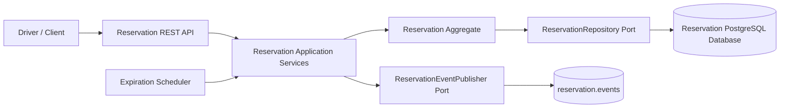
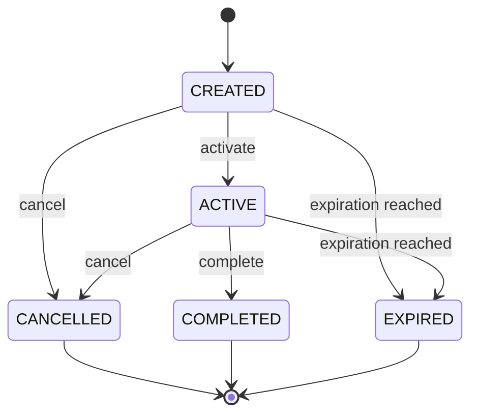

# Reservation Service — Sprint 3 Design

This document defines the independent Reservation Service requested for Sprint 3. It does not modify the Station Service, make synchronous calls to it, implement Charging or Payment, or add Kafka consumers.

## Ownership and boundaries

The service owns the Reservation aggregate, its lifecycle, expiration, persistence, REST API, and reservation events. Station, charger, user, and vehicle references are stored as IDs only; their state is not replicated through synchronous REST calls.



## Aggregate and lifecycle

`Reservation` is the aggregate root. It owns `create`, `activate`, `cancel`, `complete`, `expire`, and `isExpired` rules. The valid terminal states are `CANCELLED`, `EXPIRED`, and `COMPLETED`; terminal reservations cannot be modified. The default reservation period is ten minutes.



## API contract

| Method | Path | Purpose |
|---|---|---|
| POST | `/reservations` | Create a reservation |
| GET | `/reservations/{id}` | Retrieve one reservation |
| GET | `/reservations` | Search by status and referenced IDs |
| DELETE | `/reservations/{id}` | Cancel a reservation |
| PATCH | `/reservations/{id}/cancel` | Cancel explicitly |
| PATCH | `/reservations/{id}/complete` | Complete explicitly |

Responses use the existing RFC7807 Problem Details convention. Validation belongs at the REST boundary; lifecycle rules remain inside the aggregate.

## Persistence

The service has its own database/schema and Flyway migration. The table contains reservation identity, referenced IDs, lifecycle status, timestamps, and expiration time. Indexes are required for reservation number, station, charger, user, status, and expiration. No foreign keys reference another microservice.

## Events

The producer publishes immutable version-one records under `events.reservations.v1` (or the equivalent project event package): `ReservationCreated`, `ReservationCancelled`, `ReservationExpired`, and `ReservationCompleted`. Each event carries event and aggregate metadata plus reservation, station, charger, user, vehicle, and expiration data. Publication is asynchronous through `ReservationEventPublisher`; no Kafka consumer is part of this sprint.

## Expiration

A scheduled application use case runs once per minute, finds CREATED or ACTIVE reservations whose expiration time has passed, expires them in a transaction, and publishes `ReservationExpired`. The state transition is idempotent, so rerunning the scheduler cannot emit duplicate transitions for an already terminal reservation.

## Package shape

```text
reservation/
  application/
    ReservationApplicationService.java   (implements all use case interfaces)
    port/in/
      CreateReservationCommand.java
      CreateReservationUseCase.java
      CancelReservationUseCase.java
      CompleteReservationUseCase.java
      GetReservationUseCase.java
      ExpireReservationsUseCase.java
    port/out/
      ReservationEventPublisher.java
  domain/
    Reservation.java                      (aggregate root)
    ReservationStatus.java
    model/                                (value objects)
    events/                               (domain events)
    exception/                            (domain exceptions)
    repository/ReservationRepository.java (port)
  adapter/
    in/web/
      ReservationController.java          (depends on use case interfaces)
      ReservationResponse.java           (API DTO)
    out/persistence/
      ReservationJpaAdapter.java         (implements repository port)
  infrastructure/persistence/
    ReservationEntity.java
    ReservationJpaRepository.java
```

## Application layer (Task 3.3)

The `ReservationApplicationService` implements five use case interfaces:

- `CreateReservationUseCase` — creates, persists, and publishes `ReservationCreated`
- `CancelReservationUseCase` — cancels and publishes `ReservationCancelled`
- `CompleteReservationUseCase` — completes and publishes `ReservationCompleted`
- `GetReservationUseCase` — queries by ID or lists all
- `ExpireReservationsUseCase` — scheduled expiration, publishes `ReservationExpired`

The controller depends on use case interfaces, not on the concrete service. A shared `Clock` bean (`ClockConfig`) makes time-based logic testable. Event publishing is optional via `ObjectProvider<ReservationEventPublisher>`, so the service starts cleanly even without a Kafka adapter.

## Kafka integration (Task 3.5)

The `KafkaReservationEventPublisher` adapter implements the `ReservationEventPublisher` port and publishes immutable version-one events to the `reservation.events.v1` topic.

| Lifecycle event | Kafka record |
|---|---|
| Reservation created | `ReservationCreatedEvent` (includes `expiresAt`) |
| Reservation cancelled | `ReservationCancelledEvent` |
| Reservation completed | `ReservationCompletedEvent` |
| Reservation expired | `ReservationExpiredEvent` |

The adapter is gated by `@ConditionalOnProperty(name = "app.messaging.enabled", havingValue = "true")`, so the service starts cleanly without Kafka in development. When enabled, set `KAFKA_ENABLED=true` and `KAFKA_BOOTSTRAP_SERVERS=localhost:9092`.

## Caching (Task 3.5)

Redis caching is applied to reservation queries:

- `@Cacheable(cacheNames = "reservations", key = "#reservationId")` on `findById` — serves repeated lookups from Redis
- `@CacheEvict(cacheNames = "reservations", key = "#reservationId")` on `cancel` and `complete` — keeps cache consistent on state changes

The `Reservation` aggregate implements `Serializable` for Redis serialization, matching the `Station` domain model pattern.

## Tests (Task 3.3.5)

Three test suites cover the reservation feature:

| Test class | Scope |
|---|---|
| `ReservationTest` | Domain aggregate: create, cancel, complete, expire, isExpired |
| `ReservationApplicationServiceTest` | Use case orchestration with mock repository and event publisher |
| `ReservationControllerTest` | HTTP layer: 201/200/400/404/409 responses via MockMvc |

The application depends on ports only. JPA entities and Kafka adapters remain infrastructure concerns, preserving Hexagonal Architecture and the Reservation bounded context. This gives Sprint 4 a stable event contract for Station Service consumption without coupling the services over REST.
