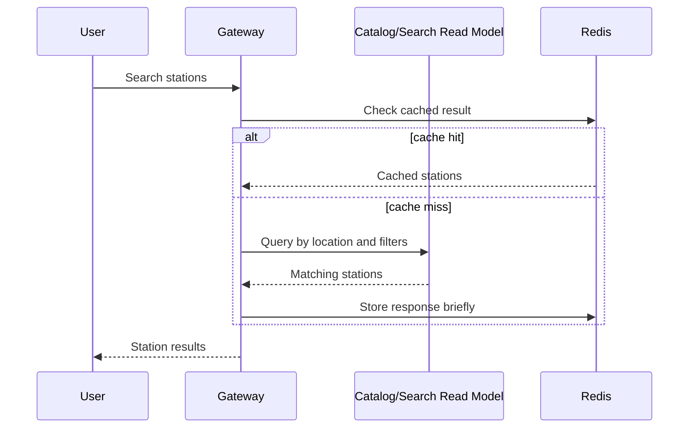
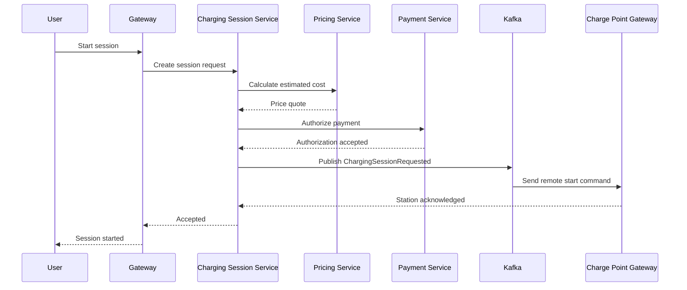
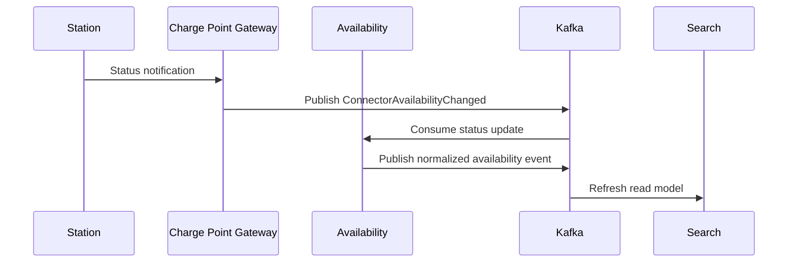
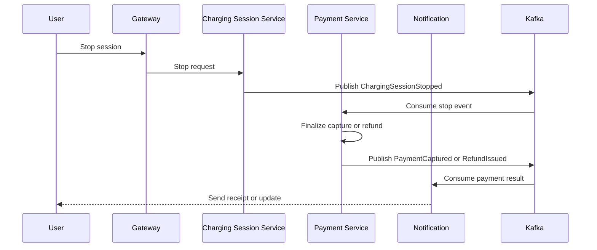

# Sequence Diagrams

## Station Search

```mermaid
sequenceDiagram
  participant User
  participant Gateway
  participant Search as Catalog/Search Read Model
  participant Redis

  User->>Gateway: Search stations
  Gateway->>Redis: Check cached result
  alt cache hit
    Redis-->>Gateway: Cached stations
  else cache miss
    Gateway->>Search: Query by location and filters
    Search-->>Gateway: Matching stations
    Gateway->>Redis: Store response briefly
  end
  Gateway-->>User: Station results
```

## Start Charging Session

```mermaid
sequenceDiagram
  participant User
  participant Gateway
  participant Session as Charging Session Service
  participant Pricing Service
  participant Payment as Payment Service
  participant Kafka
  participant GatewayDevice as Charge Point Gateway

  User->>Gateway: Start session
  Gateway->>Session: Create session request
  Session->>Pricing Service: Calculate estimated cost
  Pricing Service-->>Session: Price quote
  Session->>Payment: Authorize payment
  Payment-->>Session: Authorization accepted
  Session->>Kafka: Publish ChargingSessionRequested
  Kafka->>GatewayDevice: Send remote start command
  GatewayDevice-->>Session: Station acknowledged
  Session-->>Gateway: Accepted
  Gateway-->>User: Session started
```

## Station Status Update

```mermaid
sequenceDiagram
  participant Station
  participant GatewayDevice as Charge Point Gateway
  participant Availability
  participant Kafka
  participant Search

  Station->>GatewayDevice: Status notification
  GatewayDevice->>Kafka: Publish ConnectorAvailabilityChanged
  Kafka->>Availability: Consume status update
  Availability->>Kafka: Publish normalized availability event
  Kafka->>Search: Refresh read model
```

## Stop Charging and Settle Payment

```mermaid
sequenceDiagram
  participant User
  participant Gateway
  participant Session as Charging Session Service
  participant Payment as Payment Service
  participant Notification
  participant Kafka

  User->>Gateway: Stop session
  Gateway->>Session: Stop request
  Session->>Kafka: Publish ChargingSessionStopped
  Kafka->>Payment: Consume stop event
  Payment->>Payment: Finalize capture or refund
  Payment->>Kafka: Publish PaymentCaptured or RefundIssued
  Kafka->>Notification: Consume payment result
  Notification-->>User: Send receipt or update
```

