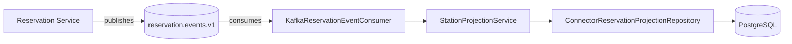
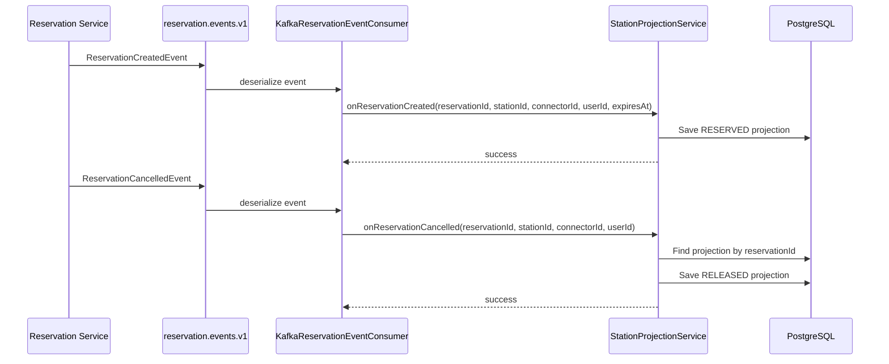

# Sprint 4 — Reservation Event Consumption

## Overview

Sprint 4 implements asynchronous event consumption in the Station Service. The Station Service listens to reservation lifecycle events from the `reservation.events.v1` Kafka topic and maintains a local projection of connector reservation states — without any synchronous REST coupling to the Reservation Service.

## Architecture



## Event Flow



## Components

### Inbound Port

`ReservationEventConsumer` — defines four methods for handling reservation lifecycle events:
- `onReservationCreated` — marks a connector as RESERVED
- `onReservationCancelled` — releases the connector
- `onReservationCompleted` — releases the connector
- `onReservationExpired` — releases the connector

### Kafka Consumer Adapter

`KafkaReservationEventConsumer` — Spring `@KafkaListener` adapter that:
- Listens to `reservation.events.v1` topic
- Uses consumer group `station-service`
- Deserializes JSON events into typed Java records
- Delegates to the `ReservationEventConsumer` port
- Gated by `@ConditionalOnProperty(name = "app.messaging.enabled", havingValue = "true")`

### Projection Application Service

`StationProjectionService` — implements `ReservationEventConsumer`:
- Creates `RESERVED` projections on `ReservationCreated`
- Transitions to `RELEASED` on `Cancelled`, `Completed`, or `Expired`
- Handles missing projections gracefully (idempotent)
- Logs all event processing for observability

### Projection Domain Model

`ConnectorReservationProjection` — immutable record tracking:
- `reservationId` (primary key)
- `stationId`, `connectorId`, `userId`
- `status` (RESERVED or RELEASED)
- `expiresAt`, `updatedAt`

### Persistence

- `ConnectorReservationProjectionEntity` — JPA entity
- `SpringDataConnectorReservationProjectionRepository` — Spring Data repository
- `ConnectorReservationProjectionAdapter` — implements the repository port
- `V4__create_connector_reservation_projections.sql` — Flyway migration with indexes

## Idempotency

The consumer is designed for at-least-once delivery:
- `ReservationCreated` upserts the projection (same reservation ID = same row)
- Release events find the existing projection by reservation ID and update it
- Missing projections on release events are logged as warnings, not errors
- Duplicate events produce the same final state

## Configuration

```yaml
spring.kafka.consumer:
  group-id: station-service
  key-deserializer: StringDeserializer
  value-deserializer: JsonDeserializer
  auto-offset-reset: earliest
  properties:
    spring.json.trusted.packages: "org.evchargingplatform.events.*"

app.messaging:
  enabled: ${KAFKA_ENABLED:false}
  reservation-topic: reservation.events.v1
  consumer-group: station-service
```

## Tests

| Test class | Scope | Tests |
|---|---|---|
| `StationProjectionServiceTest` | Projection service: create, cancel, complete, expire, idempotency, missing projection | 6 |

**Total: 49 tests, 0 failures, 0 errors — BUILD SUCCESS**

## How to test manually

1. Start the full stack with Kafka enabled:
```powershell
docker compose up --build -d
```

2. Create a reservation:
```powershell
$body = @{
    stationId = "11111111-1111-1111-1111-111111111111"
    chargerId = "22222222-2222-2222-2222-222222222222"
    userId    = "33333333-3333-3333-3333-333333333333"
    vehicleId = "44444444-4444-4444-4444-444444444444"
    startTime = (Get-Date).ToUniversalTime().AddMinutes(1).ToString("o")
} | ConvertTo-Json

$reservation = Invoke-RestMethod -Method Post -Uri http://localhost:8080/reservations -ContentType "application/json" -Body $body
```

3. Verify the projection was created in the database:
```powershell
docker compose exec postgres psql -U ev_charging -d ev_charging -c "SELECT * FROM connector_reservation_projections;"
```

4. Cancel the reservation:
```powershell
Invoke-RestMethod -Method Patch -Uri "http://localhost:8080/reservations/$($reservation.id)/cancel"
```

5. Verify the projection status changed to RELEASED:
```powershell
docker compose exec postgres psql -U ev_charging -d ev_charging -c "SELECT reservation_id, status FROM connector_reservation_projections;"
```

6. Check consumer logs:
```powershell
docker compose logs station-service --tail 50
```

Look for:
```
Received ReservationCreatedEvent
Connector ... marked as RESERVED
Received ReservationCancelledEvent
Connector ... marked as RELEASED
```

## Sprint 4 boundaries

- ✅ Station Service consumes reservation events asynchronously
- ✅ No synchronous REST coupling between services
- ✅ Reservation bounded context remains fully isolated
- ✅ Projection is a local read-model, not a replication of reservation state
- ✅ Consumer is idempotent and handles redelivery gracefully