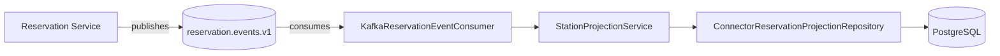
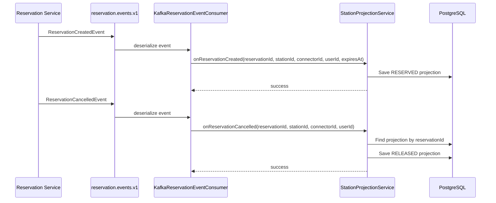

# Sprint 4 — Reservation Event Consumption

## Overview

Sprint 4 implements asynchronous event consumption in the Station Service. The Station Service listens to reservation lifecycle events from the `reservation.events.v1` Kafka topic and maintains a local projection of connector reservation states — without any synchronous REST coupling to the Reservation Service.

## Architecture


```mermaid
flowchart LR
    ReservationService[Reservation Service]
    Topic[(reservation.events.v1)]
    Consumer[KafkaReservationEventConsumer]
    ProjectionService[StationProjectionService]
    ProjectionRepo[ConnectorReservationProjectionRepository]
    DB[(PostgreSQL)]

    ReservationService -->|publishes| Topic
    Topic -->|consumes| Consumer
    Consumer --> ProjectionService
    ProjectionService --> ProjectionRepo
    ProjectionRepo --> DB
```

## Event Flow


```mermaid
sequenceDiagram
    participant Reservation as Reservation Service
    participant Kafka as reservation.events.v1
    participant Consumer as KafkaReservationEventConsumer
    participant Service as StationProjectionService
    participant DB as PostgreSQL

    Reservation->>Kafka: ReservationCreatedEvent
    Kafka->>Consumer: deserialize event
    Consumer->>Service: onReservationCreated(reservationId, stationId, connectorId, userId, expiresAt)
    Service->>DB: Save RESERVED projection
    Service-->>Consumer: success

    Reservation->>Kafka: ReservationCancelledEvent
    Kafka->>Consumer: deserialize event
    Consumer->>Service: onReservationCancelled(reservationId, stationId, connectorId, userId)
    Service->>DB: Find projection by reservationId
    Service->>DB: Save RELEASED projection
    Service-->>Consumer: success
```

## Components

### Inbound Port

`ReservationEventConsumer` — defines four methods for handling reservation lifecycle events:
- `onReservationCreated` — marks a connector as RESERVED
- `onReservationCancelled` — releases the connector
- `onReservationCompleted` — releases the connector
- `onReservationExpired` — releases the connector

### Kafka Consumer Adapter

`KafkaReservationEventConsumer` — Spring `@KafkaListener` adapter that:
- Listens to `reservation.events.v1` topic
- Uses consumer group `station-service`
- Deserializes JSON events into typed Java records
- Delegates to the `ReservationEventConsumer` port
- Gated by `@ConditionalOnProperty(name = "app.messaging.enabled", havingValue = "true")`
- Registers a single consumer for the topic/group and dispatches each of the four event types via `@KafkaHandler` methods (see [Bug Fix — Kafka Listener Type Dispatch](#bug-fix--kafka-listener-type-dispatch) below)

### Projection Application Service

`StationProjectionService` — implements `ReservationEventConsumer`:
- Creates `RESERVED` projections on `ReservationCreated`
- Transitions to `RELEASED` on `Cancelled`, `Completed`, or `Expired`
- Handles missing projections gracefully (idempotent)
- Logs all event processing for observability

### Projection Domain Model

`ConnectorReservationProjection` — immutable record tracking:
- `reservationId` (primary key)
- `stationId`, `connectorId`, `userId`
- `status` (RESERVED or RELEASED)
- `expiresAt`, `updatedAt`

### Persistence

- `ConnectorReservationProjectionEntity` — JPA entity
- `SpringDataConnectorReservationProjectionRepository` — Spring Data repository
- `ConnectorReservationProjectionAdapter` — implements the repository port
- `V4__create_connector_reservation_projections.sql` — Flyway migration with indexes

## Idempotency

The consumer is designed for at-least-once delivery:
- `ReservationCreated` upserts the projection (same reservation ID = same row)
- Release events find the existing projection by reservation ID and update it
- Missing projections on release events are logged as warnings, not errors
- Duplicate events produce the same final state

## Configuration

```yaml
spring.kafka.consumer:
  group-id: station-service
  key-deserializer: StringDeserializer
  value-deserializer: JsonDeserializer
  auto-offset-reset: earliest
  properties:
    spring.json.trusted.packages: "org.evchargingplatform.events.*"

app.messaging:
  enabled: ${KAFKA_ENABLED:false}
  reservation-topic: reservation.events.v1
  consumer-group: station-service
```

## Tests

| Test class | Scope | Tests |
|---|---|---|
| `StationProjectionServiceTest` | Projection service: create, cancel, complete, expire, idempotency, missing projection | 6 |

**Total: 49 tests, 0 failures, 0 errors — BUILD SUCCESS**

## How to test manually

1. Start the full stack with Kafka enabled:
```powershell
docker compose up --build -d
```

2. Create a reservation:
```powershell
$body = @{
    stationId = "11111111-1111-1111-1111-111111111111"
    chargerId = "22222222-2222-2222-2222-222222222222"
    userId    = "33333333-3333-3333-3333-333333333333"
    vehicleId = "44444444-4444-4444-4444-444444444444"
    startTime = (Get-Date).ToUniversalTime().AddMinutes(1).ToString("o")
} | ConvertTo-Json

$reservation = Invoke-RestMethod -Method Post -Uri http://localhost:8080/reservations -ContentType "application/json" -Body $body
```

3. Verify the projection was created in the database:
```powershell
docker compose exec postgres psql -U ev_charging -d ev_charging -c "SELECT * FROM connector_reservation_projections;"
```

4. Cancel the reservation:
```powershell
Invoke-RestMethod -Method Patch -Uri "http://localhost:8080/reservations/$($reservation.id)/cancel"
```

5. Verify the projection status changed to RELEASED:
```powershell
docker compose exec postgres psql -U ev_charging -d ev_charging -c "SELECT reservation_id, status FROM connector_reservation_projections;"
```

6. Check consumer logs:
```powershell
docker compose logs station-service --tail 50
```

Look for:
```
Received ReservationCreatedEvent
Connector ... marked as RESERVED
Received ReservationCancelledEvent
Connector ... marked as RELEASED
```

## Bug Fix — Kafka Listener Type Dispatch

The original implementation annotated all four handler methods (`onReservationCreated`, `onReservationCancelled`, `onReservationCompleted`, `onReservationExpired`) with their own `@KafkaListener(topics = ..., groupId = "station-service")`. That registers **four independent consumers in the same consumer group on the same topic**, so Kafka splits the topic's partitions across them. A given event lands on whichever of the four listeners owns that partition, not on the listener whose method signature matches the event's type — so most events arrived at a listener expecting a different record type and failed to deserialize/convert.

**Fix:** moved `@KafkaListener(topics = ..., groupId = "station-service")` to the class level, and changed each handler method to `@KafkaHandler`. This registers exactly one consumer for the topic/group; Spring Kafka's `JsonDeserializer` resolves the concrete event type from the `__TypeId__` header the producer's `JsonSerializer` already adds, and routes the deserialized payload to the `@KafkaHandler` method whose parameter type matches. No changes were needed to the producer, the event records, or `application.yml` — `spring.json.trusted.packages` was already configured correctly.

Changed file: `src/main/java/org/evchargingplatform/station/adapter/in/messaging/KafkaReservationEventConsumer.java`.

## End-to-End Verification

After the fix, the flow was verified against the real stack rather than only unit tests:

1. `mvn -o compile` and `mvn -o test` — build succeeds, all 49 tests pass (no test changes were needed; `StationProjectionServiceTest` calls the application service directly and doesn't exercise the listener wiring, so it couldn't have caught this bug).
2. `docker compose up --build -d` — full stack (Postgres, Redis, Kafka, Jaeger, station-service) built and started with `KAFKA_ENABLED=true`.
3. `POST /reservations` — created a reservation, which published `ReservationCreatedEvent`. Confirmed via `psql` that `connector_reservation_projections` got a `RESERVED` row, and via `docker compose logs` that `KafkaReservationEventConsumer` logged `Received ReservationCreatedEvent`.
4. `PATCH /reservations/{id}/cancel` — published `ReservationCancelledEvent`. Confirmed the same projection row transitioned to `RELEASED`, and the log showed `Received ReservationCancelledEvent` handled by the same listener container thread (`container#0-0-C-1`) that handled the created event — proving a single consumer now correctly dispatches both event types by type, which is exactly the scenario the bug broke.
5. `docker compose down` — stack torn down after verification.

`onReservationCompleted` and `onReservationExpired` were not separately exercised end-to-end in this pass — there is no `activate` REST endpoint to move a reservation to `ACTIVE` first, so `PATCH /reservations/{id}/complete` isn't currently reachable from a freshly created reservation, and expiry requires waiting out the scheduler's poll interval. Both handlers use the identical `@KafkaHandler` dispatch mechanism and structurally identical event records as the two verified above, so they carry no additional risk from this fix, but a full lifecycle demo is still open work.

Fix committed as `bb19015` on `feature/sprint-4-event-consumption` and pushed to origin.

## Sprint 4 boundaries

- ✅ Station Service consumes reservation events asynchronously
- ✅ No synchronous REST coupling between services
- ✅ Reservation bounded context remains fully isolated
- ✅ Projection is a local read-model, not a replication of reservation state
- ✅ Consumer is idempotent and handles redelivery gracefully
- ✅ Kafka listener dispatches all four reservation event types correctly from a single consumer (post-implementation bug fix, see above)
- ✅ Fix verified end-to-end against the real Docker Compose stack, not just unit tests
- ⬜ `onReservationCompleted` / `onReservationExpired` not yet exercised end-to-end (no `activate` endpoint; expiry needs a longer-running manual test)