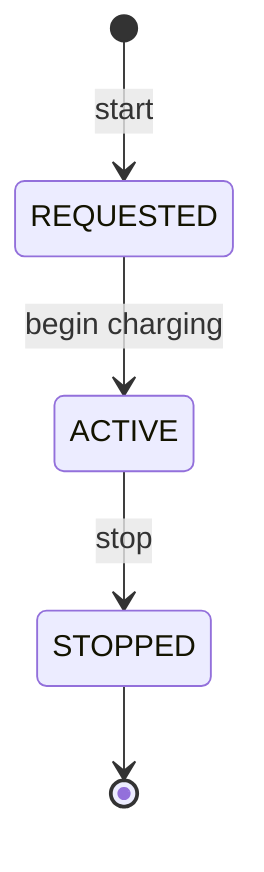

# Sprint 5 — Charging Session Feature (Plan)

> Status: **not started.** This document is the plan and mentor guide for the sprint, written before implementation — unlike the other sprint docs in this folder, which were written after the work was done. Update the "Status" lines as you go instead of rewriting the doc.

## Goal

Build the Charging context as a new package-by-feature module (`charging/`) in the same Spring Boot application, following the exact hexagonal shape already used by `reservation/` and `station/`. By the end of the sprint a driver can start a charging session, the system records it, stops it, and the session lifecycle is published to Kafka the same way reservation events are.

This is the third bounded context to land in the codebase. Session 4 gave the Station Service a read-model of reservation state; this sprint gives you a chance to decide, deliberately, whether Charging should reuse that read-model or not (see Design Decision 1 below) — that's the main architectural judgment call in this sprint, more than the CRUD scaffolding.

## Ownership and boundaries (mirrors `reservation-service.md`)

The Charging feature owns the `ChargingSession` aggregate, its lifecycle, persistence, REST API, and charging events. Station, connector, user, vehicle, and reservation references are stored as IDs only.

**In scope this sprint:**
- Start and stop a charging session.
- Persist session state in its own table.
- Publish `ChargingSessionRequested`, `ChargingSessionStarted`, `ChargingSessionStopped` to Kafka (event records already exist — see below).
- REST endpoints to start, stop, and read sessions.

**Out of scope this sprint** (matches the project's own "Recommended Delivery Sequence" in `architecture.md` — pricing and payment come after reservation/session, notification and reporting after that):
- No Pricing Service / cost calculation.
- No Payment authorization — a session starts without a payment step for now.
- No Charge Point Gateway / device protocol / OCPP — `SessionCommand` stays a future concern.
- No Kafka **consumer** in the Charging feature. Don't subscribe to reservation or any other topic this sprint — the previous sprint's Kafka bug (four `@KafkaListener`s fighting over one topic/group) is exactly the kind of mistake that's easy to repeat if you add a consumer under time pressure. If you do end up needing one later, go back and re-read the "Bug Fix" section of `sprint-4-event-consumption.md` first.
- Meter value recording (`MeterValueRecordedEvent` already exists as a record) is a **stretch goal**, not required for done — see the note at the end of the Events section.

## Already in place — don't recreate these

The event contracts for this sprint were scaffolded ahead of time:

- `org.evchargingplatform.events.charging.v1.ChargingSessionRequestedEvent`
- `org.evchargingplatform.events.charging.v1.ChargingSessionStartedEvent`
- `org.evchargingplatform.events.charging.v1.ChargingSessionStoppedEvent`
- `org.evchargingplatform.events.charging.v1.MeterValueRecordedEvent`

Read all four before you design the aggregate — the fields on `ChargingSessionStoppedEvent` (`totalEnergyKwh`) and `ChargingSessionRequestedEvent` (`reservationId`) constrain what your aggregate needs to track.

The API surface is also already committed to in `docs/api-design.md`:

```
POST /charging/start
POST /charging/stop
GET  /charging/sessions/{id}
```

That doc is a plan, not a contract carved in stone — Design Decision 2 below asks you to reconsider its shape against the convention the Reservation Service actually established. Update `api-design.md` if you deviate from it.

## Design decisions for you to make

Don't skip these — they're the point of the sprint, not busywork around it.

### Decision 1 — Should Charging validate against the Station Service's reservation projection?

Sprint 4 gave the Station feature a `ConnectorReservationProjectionRepository` port with `findByReservationId(UUID)`, populated live from reservation events. When a driver calls `POST /charging/start` with a `reservationId`, should the Charging application service inject that port and check the connector is actually `RESERVED` for that user before starting?

- **Option A — call the port directly.** It's the same JVM, the same deployable; this is a legitimate hexagonal cross-context call through a port interface (not through the JPA entity, not through HTTP). DDD guidance in `domain-driven-design.md` explicitly allows this: "keep context APIs explicit... use domain events for cross-context state changes" is about *separately deployed* services — within one module, an interface call is the equivalent of an in-process anti-corruption layer.
- **Option B — skip validation, treat `reservationId` as an opaque optional field.** Keeps Charging fully decoupled, ready for the day it becomes an actual separate microservice (at which point it would need its own async projection built the same way Station's was in Sprint 4, consuming reservation events itself). More honest about the target architecture, less useful right now.

Recommendation: **Option A** for this sprint, with a comment noting it's a temporary shortcut that assumes single-deployable — but it's your call, and either is defensible. If you pick A, inject the interface type (`ConnectorReservationProjectionRepository`), never the JPA entity or the station package's persistence classes.

### Decision 2 — REST shape: follow `api-design.md`'s verbs, or the Reservation Service's resource convention?

`api-design.md` says `POST /charging/start` / `POST /charging/stop`. But `ReservationController` (built one sprint later) settled on a different, arguably more RESTful convention: `POST /reservations` to create, `PATCH /reservations/{id}/cancel` and `PATCH /reservations/{id}/complete` for state transitions. Two real options, pick one and be consistent:

- Keep `POST /charging/start` / `POST /charging/stop` as documented — `start` needs the full command body (stationId, connectorId, userId, vehicleId, reservationId?), `stop` needs a session id somewhere (path variable is still fine even with a POST verb: `POST /charging/sessions/{id}/stop`).
- Switch to the Reservation convention: `POST /charging/sessions` to start, `PATCH /charging/sessions/{id}/stop` to stop.

Whichever you choose, update `docs/api-design.md` to match — don't leave the doc and the code disagreeing.

### Decision 3 — Value objects or raw UUIDs in the aggregate?

`reservation/domain/model/` has `StationId`, `ConnectorId`, `DriverId`, `VehicleId`, `ReservationId` — small wrapper records. Worth knowing before you copy that pattern: **the `Reservation` aggregate itself doesn't use any of them** — it stores raw `UUID stationId`, `UUID chargerId`, etc. The value-object files exist but are dead code in the current implementation. You can either follow what the code actually does (raw UUIDs — simpler, consistent with what's proven to compile and pass tests) or follow what the package structure implies you should do (wrap every foreign ID) and actually wire it through, fixing the inconsistency instead of repeating it. Either is fine; going in aware of the inconsistency is the point.

## Aggregate and lifecycle

Suggested shape (adjust once you've made Decision 1):

```
ChargingSession(
  id, stationId, connectorId, userId, vehicleId,
  reservationId (nullable — walk-up charging without a reservation is valid),
  status, startedAt, stoppedAt, totalEnergyKwh,
  createdAt, updatedAt
)
```

States: `REQUESTED → ACTIVE → STOPPED`. Unlike `Reservation`, there's no `CANCELLED` here in scope — stopping early and stopping normally are the same terminal transition for this sprint. Don't add states you don't have a use case for yet.



Mirror `Reservation`'s approach: an immutable record, static `create(...)` factory, `Clock`-based instant methods (`start(Clock)`, `stop(Clock, totalEnergyKwh)`), a terminal-state guard like `ensureNotTerminal()`. Reuse `ClockConfig` — don't create a second `Clock` bean.

## Package shape

```text
charging/
  application/
    ChargingSessionApplicationService.java   (implements all use case interfaces)
    port/in/
      StartChargingSessionCommand.java
      StartChargingSessionUseCase.java
      StopChargingSessionUseCase.java
      GetChargingSessionUseCase.java
    port/out/
      ChargingSessionEventPublisher.java
  domain/
    ChargingSession.java
    ChargingSessionStatus.java
    exception/
      ChargingSessionNotFoundException.java
      (+ whatever guard exceptions your state transitions need)
  adapter/
    in/web/
      ChargingController.java
      ChargingSessionResponse.java
    out/persistence/
      ChargingSessionJpaAdapter.java
    out/messaging/
      KafkaChargingSessionEventPublisher.java
  infrastructure/persistence/
    ChargingSessionEntity.java
    ChargingSessionJpaRepository.java
```

This should feel entirely familiar — it's the same shape as `reservation/`, file for file.

## Persistence

New Flyway migration `V5__create_charging_sessions.sql` (don't reuse or renumber V4 — it's already applied). Table needs indexes on `station_id`, `connector_id`, `user_id`, and `status`, matching the indexing guidance in `database-design.md`. Look at `V2__create_reservations.sql` for the column-naming and index style to match.

## Events

Publish through a `ChargingSessionEventPublisher` output port, gated the same way `ReservationEventPublisher` is: `@ConditionalOnProperty(name = "app.messaging.enabled", havingValue = "true")`, injected as `ObjectProvider<ChargingSessionEventPublisher>` so the app starts without Kafka in dev, `eventPublisher.ifAvailable(...)` at each call site. Topic: add `charging-events-topic` (default `charging.events.v1`) to `application.yml` under `app.messaging`, same pattern as `reservation-topic`.

| Lifecycle point | Event |
|---|---|
| Session start requested | `ChargingSessionRequestedEvent` |
| Session becomes active | `ChargingSessionStartedEvent` |
| Session stops | `ChargingSessionStoppedEvent` (carries `totalEnergyKwh`) |

If `POST /charging/start` both creates and activates in one call (no separate "pending approval" step exists yet), you can publish `Requested` immediately followed by `Started` in the same use case — that's consistent with there being no intermediate REQUESTED-only workflow yet.

**Stretch goal, not required for done:** `MeterValueRecordedEvent` exists but has no REST trigger anywhere in `api-design.md`. If you have time left, add `POST /charging/sessions/{id}/meter-values` and a small append-only `session_meter_values` table (`sessionId, energyKwh, powerKw, recordedAt`) — no updates, ever, per the DDD rule that meter readings are append-only facts. If you don't get to it, leave it out cleanly rather than half-wiring it.

## Testing checklist

Match the three-suite pattern from Sprint 3 (`ReservationTest`, `ReservationApplicationServiceTest`, `ReservationControllerTest`):

- **Domain test** — create, start, stop, terminal-state guard, any Decision-1 validation logic if you put it in the aggregate rather than the application service.
- **Application service test** — use case orchestration with mocked repository and event publisher (and mocked `ConnectorReservationProjectionRepository` if you went with Decision 1 Option A).
- **Controller test** — MockMvc, 201/200/400/404/409 depending on your Decision 2 endpoint shapes.

## Suggested build order

Work bottom-up, the same order the reservation sprint used, and compile/test after each stage rather than writing everything before checking anything:

1. Domain aggregate + status enum + unit tests. Get `mvn -o test` green on just the domain layer before moving on.
2. Ports (`in` and `out` interfaces) + `CreateChargingSessionCommand`-equivalent.
3. Application service against mocked ports. Green tests here mean your orchestration logic is right independent of Spring, JPA, or Kafka.
4. Persistence: entity, Spring Data repo, adapter, Flyway migration. Run the app locally (`mvn spring-boot:run`, no Kafka needed yet) and hit the endpoints with `Invoke-RestMethod` once the controller exists.
5. Controller + DTOs + exception mapping (reuse `ApiExceptionHandler` — check whether your new exceptions need a new `@ExceptionHandler` case there, mirroring how `ReservationNotFoundException` etc. are handled).
6. Kafka publisher, gated and wired like the reservation one. Enable with `KAFKA_ENABLED=true` locally, or Docker Compose (add `station-service`'s existing pattern — no new services needed, one app).
7. Full `docker compose up --build -d` smoke test: start a session, confirm the event lands (you can point a throwaway consumer at the topic, or just check `docker compose logs station-service` — actually the *station* service won't consume charging events, so instead verify via Kafka directly: `docker compose exec kafka /opt/kafka/bin/kafka-console-consumer.sh --bootstrap-server localhost:9092 --topic charging.events.v1 --from-beginning`).
8. Update `docs/api-design.md` if you changed the endpoint shapes (Decision 2).
9. Update this doc's Status line and add a "What we actually built" section at the bottom once done — don't rewrite the plan above, append below it, same rule as last time.

## Definition of done

- `mvn -o test` green, new tests included, existing 49+ still passing.
- `POST` start → `GET` session shows `ACTIVE` → `POST/PATCH` stop → `GET` session shows `STOPPED`, verified against the real Docker Compose stack, not just MockMvc.
- All three charging events observed on the topic for one full session lifecycle.
- `docs/api-design.md` matches whatever endpoint shapes you actually built.
- Design Decisions 1–3 above are each resolved one way or the other, and the choice is visible in the code (not just in your head) — a short Javadoc comment on the aggregate or application service explaining *why* is enough.

## How I can help

Ask me to review any layer as you finish it rather than only at the end — same as we'd do with a real PR. If you get stuck on the Kafka gating or the `ObjectProvider` pattern, `ReservationApplicationService.java` and `KafkaReservationEventPublisher.java` are the two files to have open side by side with whatever you're writing. If something in this plan turns out to be wrong once you're in the code (e.g. the projection port doesn't fit the way Decision 1 assumes), that's normal — tell me and we'll adjust the plan rather than force the code to match a doc that was wrong.
